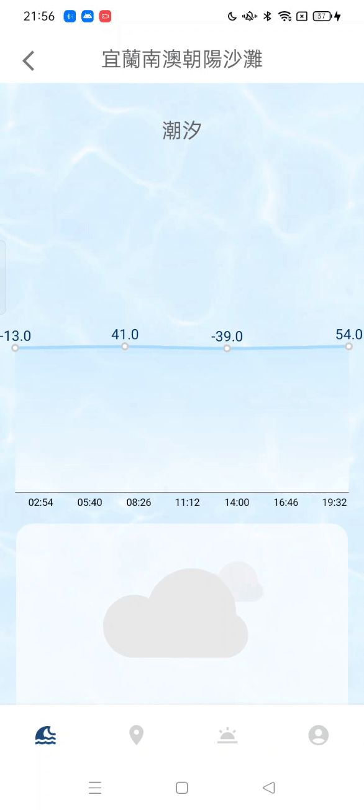
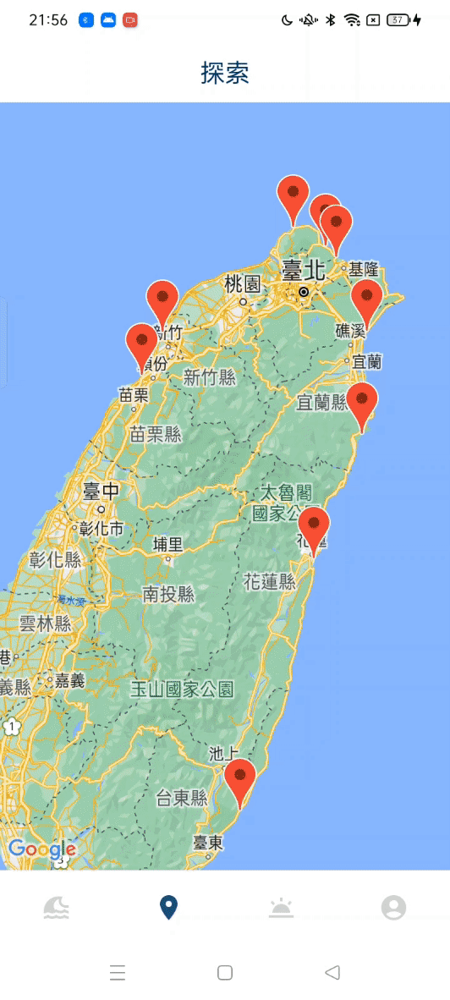
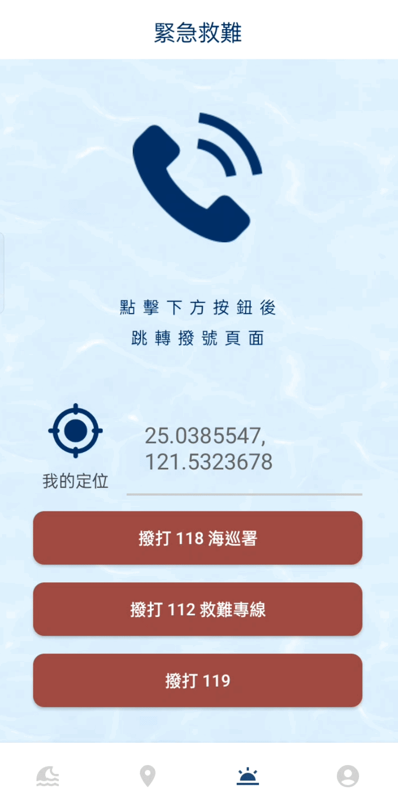

# SurFin

<p align="center">

</p>

<p>
  <b>
SurFin welcomes you to a heartwarming journey through cherished surf spots, accompanied by cozy weather updates and delightful snapshots.  </b> 

<p><a href="https://drive.google.com/file/d/1fNcjAQN6MoF56KwMzYYFkQtj4jvAloU_/view?usp=share_link">
<button >
      Click me to download
    </button>
</a></p>


## Features

<table>
  <tr>
     <th>Weather Page</th>
     <th>Explore Page</th>
  </tr> 
  <tr>
     <th>**User-friendly Visual Elements:** Weather and tide variations are represented through engaging visual elements, incorporating tools like Lottie and MPAndroidChart.</th>
     <th>**Integrated Google Maps SDK:** Offers easy browsing of surf spots. Tapping on each marker provides detailed insights which are complemented with pinch-to-zoom photos.</th>
  </tr>

  <tr>
    <td>
           
   </td>
   <td>
           
   </td>

   <tr>
     <th>Emergency Page</th>
     <th>Account Page</th>
  </tr> 
   <tr>
     <th>Emergency Page</th>
     <th>Account Page</th>
  </tr>
   <td>
           
   </td>
  </tr>

 <tr>
     <th>Log Page</th>
     <th>Collection Page</th>
  </tr> 

   <tr>
     <th>Log Page</th>
     <th>Collection Page</th>
  </tr>
    <tr>
    <td>
           
   </td>
   <td>
           
   </td>

 </table>


- 
- **Firebase Cloud Firestore:** Utilized to store vital information sourced from government APIs.
- 
- 


## Skills

- MVVM (Model-View-ViewModel)
- Observer Pattern
- Room
- SharedPreferences
- MPAndroidChart
- Android Material Components
- Corountine
- Unit test
- Retrofit
- Moshi
- Glide
- Firebase Cloud Firestore


## Installation

To begin working with this repository in **Android Studio**, kindly follow below instructions.

1. Connect to Firebase Cloud Firestore with your own API key

2. In the `app/src/main/AndroidManifest.xml` file, please update your Google Maps SDK API key with the following configuration:

    ```xml
    <meta-data
        android:name="com.google.android.geo.API_KEY"
        android:value="${YOUR_GOOGLE_MAP_API_KEY}"/>
    ```

3. Additionally, ensure you add your CWA (Central Weather Administration of Taiwan) API key in the `local.properties` file using the format:

    ```
    API_KEY = YOUR_CWA_API_KEY
    ```

- [Get your own Firebase Cloud Firestore API key](https://console.firebase.google.com/u/0/)<br>
- [Get your own Google Maps SDK API key](https://developers.google.com/maps?hl=zh-tw)<br>
- [Get your own CWA API key](https://opendata.cwa.gov.tw/userLogin)<br>


## Requirement

- SDK 28 (Android 9.0) or later


## Thrid-Party Libraries
- [Firestore](https://firebase.google.com/products/firestore?gclid=Cj0KCQiA-qGNBhD3ARIsAO_o7ynVqh2xVTgG6WIKFSfdCN4x9lHJrit2kdCT99IfZPNxPPbbtPHr6qsaAv4lEALw_wcB&gclsrc=aw.ds)
- [lottie](https://lottiefiles.com)
- [MPAndroidChart](https://github.com/PhilJay/MPAndroidChart)
- [TouchImageView](https://github.com/MikeOrtiz/TouchImageView)


## Contact

