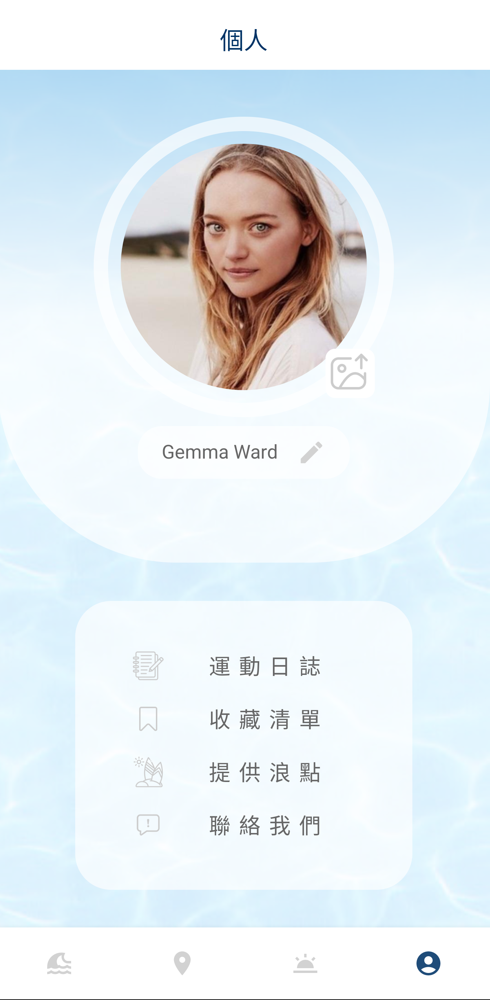

# SurFin

<p align="center">

</p>

<p>
  <b>
SurFin welcomes you to a heartwarming journey through cherished surf spots, accompanied by cozy weather updates and delightful snapshots.  </b> 

<p><a href="https://drive.google.com/file/d/1fNcjAQN6MoF56KwMzYYFkQtj4jvAloU_/view?usp=share_link">
<button >
     Download APK
    </button>
</a></p>


---

## Features

<table>
  <tr>
     <th>Weather Page</th>
     <th>Explore Page</th>
  </tr> 
  <tr>
     <th align="left" width="250" >Weather and tide variations are represented through engaging visual elements.</th>
     <th align="left" width="250" >Offering easy browsing of surf spots. Tapping on each marker provides detailed insights which are complemented with pinch-to-zoom photos.</th>
  </tr>

  <tr>
    <td align="center">
           
   </td>
   <td align="center">
           
   </td>

   <tr>
     <th>Emergency Page</th>
     <th>Account Page</th>
  </tr> 
   <tr>
     <th align="left">Offering expedited dialing and displays the user's location, ensuring precise emergency response in crucial moments.</th>
     <th align="left">Allowing users to update profile pictures and names. It provides direct navigation to the Exercise Journal and Collection pages and includes an options menu for recommending additional functionalities.</th>
  </tr>
   <td align="center">
           
   </td>
  <td align="center">
           
   </td>
 <tr>
     <th>Journal Page</th>
     <th>Collection Page</th>
  </tr> 

   <tr>
     <th align="left">Providing users a space to record their surfing experiences, ensuring they can document specifics and track their sessions.</th>
     <th align="left">Allowing users to catalog and preserve their favored surfing locations, offering a specialized area to view their highlighted spots.</th>
  </tr>
    <tr>
     <td align="center">
           
    </td>
   <td align="center">
           
   </td>

 </table>


## Skills

- MVVM 
- Observer Pattern
- Singleton Pattern
- Coroutine
- Room
- SharedPreferences
- Google Maps SDK
- Android Material Components
- MPAndroidChart
- Glide
- Retrofit
- Moshi
- Firebase Cloud Firestore
- Unit test


## Installation

To begin working with this repository in **Android Studio**, kindly follow below instructions.


1. **Firebase Cloud Firestore**: Connect with your API key. <br>
[Get it here](https://console.firebase.google.com/u/0/).
   
2. **Google Maps SDK**:
   Replace the placeholder with your API key in `app/src/main/AndroidManifest.xml`.  <br>
   [Get it here](https://developers.google.com/maps?hl=en)
   ```xml
    <meta-data
        android:name="com.google.android.geo.API_KEY"
        android:value="${YOUR_GOOGLE_MAP_API_KEY}"/>
    ```

4. **CWA**:
   Insert your API key in the `local.properties` file. <br>
   [Get it here](https://opendata.cwa.gov.tw/userLogin)

## Requirement

- Compatible with SDK 28 (Android 9.0) or later.


## Third-Party Libraries
- [Firestore](https://firebase.google.com/products/firestore?gclid=Cj0KCQiA-qGNBhD3ARIsAO_o7ynVqh2xVTgG6WIKFSfdCN4x9lHJrit2kdCT99IfZPNxPPbbtPHr6qsaAv4lEALw_wcB&gclsrc=aw.ds)
- [Lottie](https://lottiefiles.com)
- [MPAndroidChart](https://github.com/PhilJay/MPAndroidChart)
- [TouchImageView](https://github.com/MikeOrtiz/TouchImageView)


## Contact

Jack Yu
- **Email**: jack.yu4041@gmail.com
- **LinkedIn**: [Tzuchieh Yu](https://www.linkedin.com/in/tzuchieh-yu)


## License
Distributed under the MIT License.
